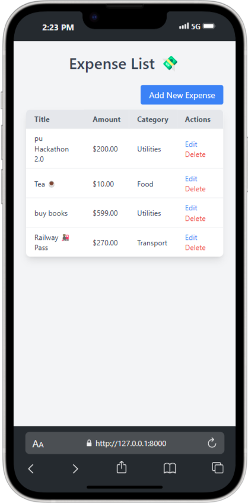

### Expense Tracker

-- it is a simple personal expense tracker web appliaction buit using django + postgress(Supabse) + Taailwind css

## Get all Expenses

## Add Expense

## Mobile View

## Update Expense

## Delete Expense

## Supabse Postgress Data

## Supabse Postgress Data

This Project is build while Learning Django ☕🚀
